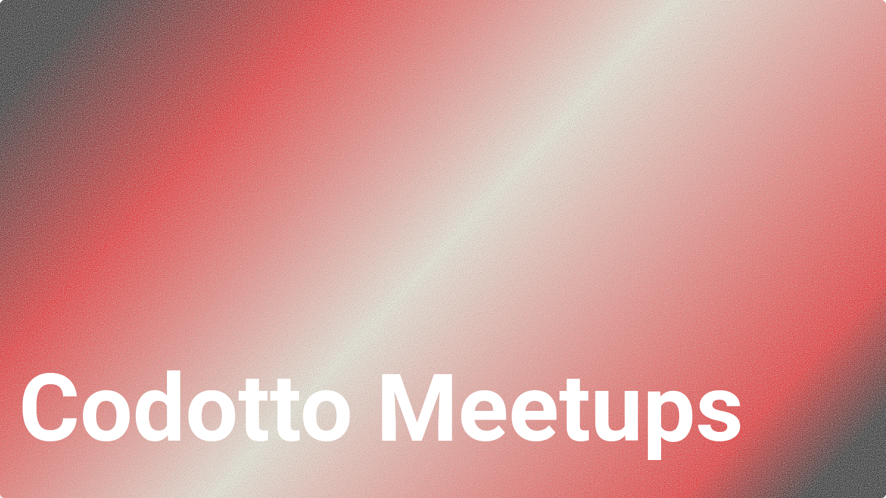
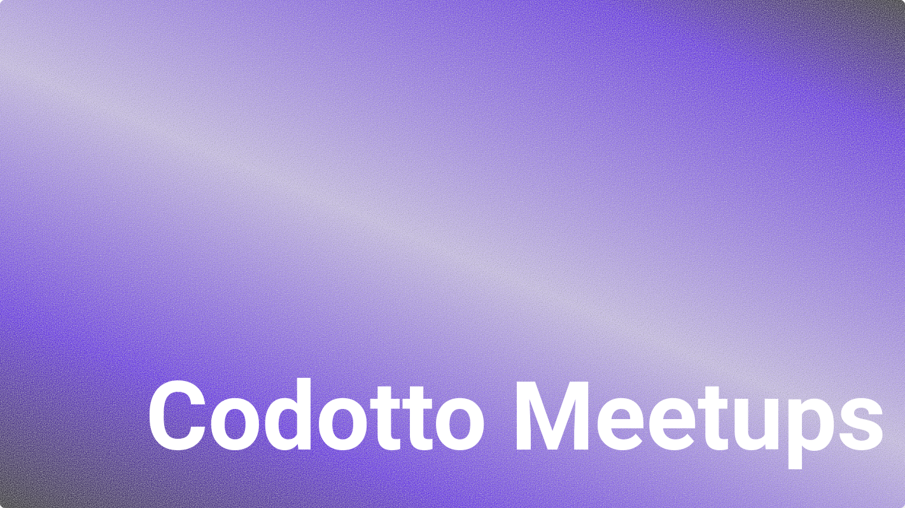

# Introduction
Introducing Codotto Image Generator - a simple tool for creating stunning visuals that will take your blog or group page to the next level.

The easy-to-use image generator makes it easy to generate images with a simple design that you can use in your blog posts, group images or even meetups.

# Examples
You can control simple controls such as:

- title of the image
- font size
- the noise that is being added to the background gradient
- position of the text
- blend mode
- gradient that will be used (currently we are not supporting custom gradients)

# The future plan

This project was created to help us at [codotto.com](https://codotto.com) creating images for our blog posts
and other medias without having to take precious time of designers. This also allows the meetup organizers
and group owners to be able to create simple and beautiful images to use as their meetup or group covers.

Currently, we are only supporting a simple design pattern with a background gradient but
in our plans we would like to keep adding design images where it will be easy and simple
to create new image posters.
